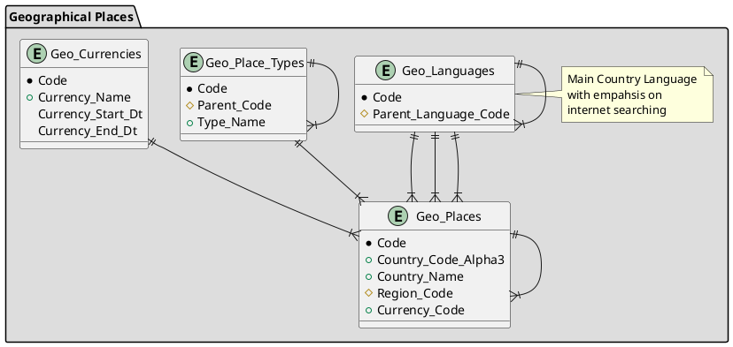

# Geo - Geographical Places

## Featues

* All place types are intentionally represented in `Geo_Places`.
* Any table can reference a place if it's all in one table.
* Geo_Places capture fields that might be relevant to web scraping and machine learning.
* Geo_Places must also consider time as well as place to allow for ancient historical data.

## Requirements

* Oracle Database
* Oracle SQL Developer

## Example Query

```sql
-- --------------------------------------------------------------------------------
-- Demonstrate hierarchical query of data
-- --------------------------------------------------------------------------------
SELECT code, parent_code, place_name, level
FROM geo_places
CONNECT BY prior parent_code = code
START WITH 
    --code = 'BES' 
    place_name = 'Canary Islands';
```

## Entity Relationship Diagram



<!-- PlantUML Entity Relationship Diagram
Zero or One 	|o--
Exactly One 	||--
Zero or Many 	}o--
One or Many 	}|--

* Primary/Unique column
+ mandatory column
# Foreign column

- private
# protected
~ package private
+ public
-->