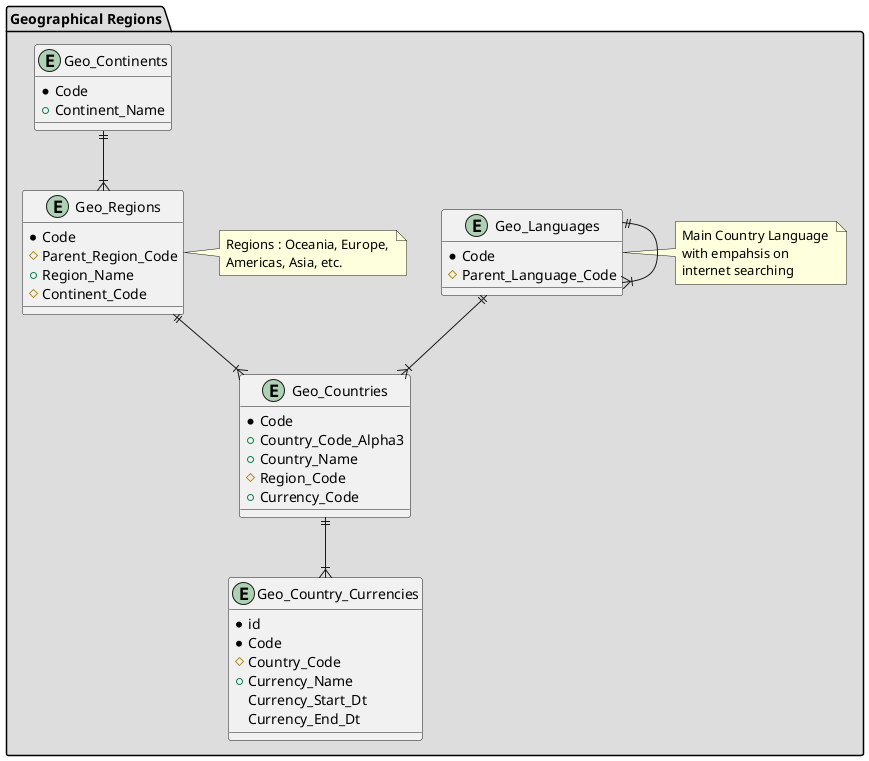

# Geo - Geographical Regions

## Requirements

 * Build Oracle database using MV5Servers\Vagrant-XE21c-Apex22
 * Oracle SQL Developer

## Relationship Diagram

<!-- PlantUML Entity Relationship Diagram
Zero or One 	|o--
Exactly One 	||--
Zero or Many 	}o--
One or Many 	}|--

* Primary/Unique column
+ mandatory column
# Foreign column

- private
# protected
~ package private
+ public
-->